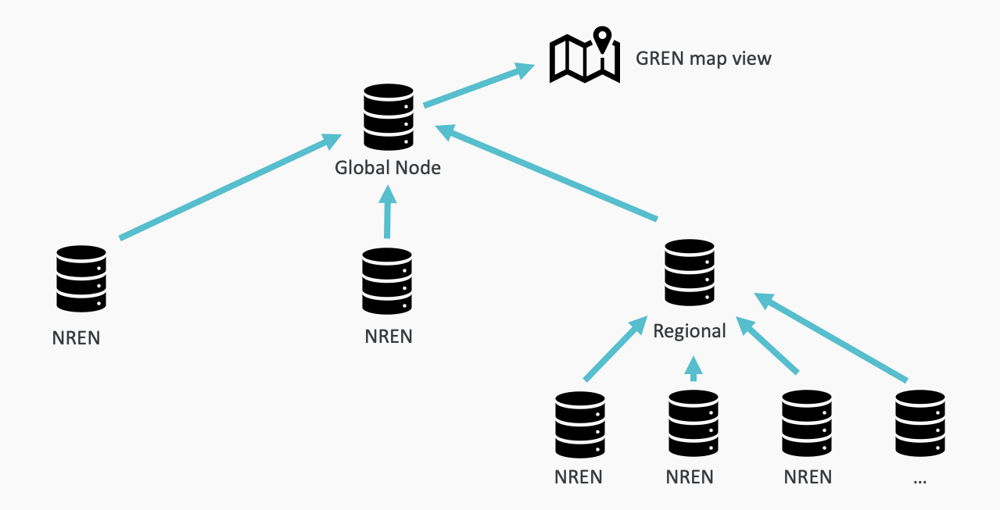
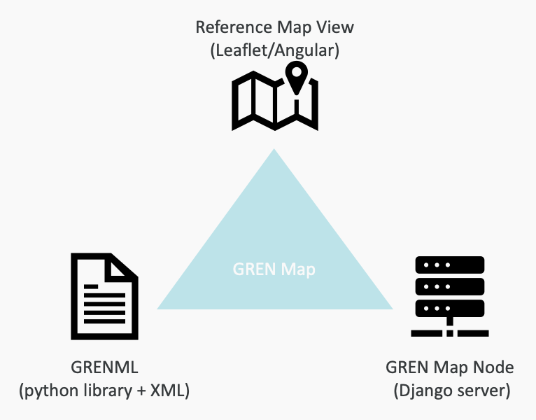

# Global Research and Education Network Mapping

These are components of a software system to store and access information on the world-wide network that connects colleges, universities and research institutes.

**Start here**
- https://grenmap.github.io/GREN-Map-DB-Node/
- https://grenmap.github.io/GRENML/
- https://grenmap.github.io/GREN-Map-Visualization/

**GREN Map DB Node** is a containerized Django application. It is a database of the nodes and links in the GREN.

GREN map DB nodes form a hierarchy. The rank of a node relates to the size of the geopolitical partition it represents. Inferior nodes contribute data to superior nodes. The top-level node contains the representation of the entire network: all nodes and links in all countries.

**GRENML** is a Python library that can serialize and deserialize the network data structures to and from XML.

The term GRENML also refers to the format for data exchange between GREN map DB nodes.

**GREN Map Visualization** is an Angular web front-end application that displays the network over a geographical map.

GRENML and GREN Map Visualization ship with the GREN map DB node.

We also provide examples on how to deploy on Kubernetes and with docker compose.
